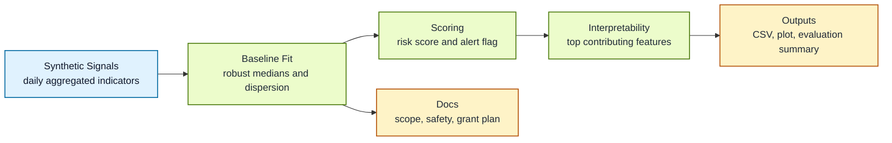

# Privacy-Safe AI for Early Public-Health Signal Monitoring

*A cautious prototype for interpretable, privacy-aware early warning analytics on synthetic data.*

> [!NOTE]
> **In plain language**
> Big public-health problems do not usually begin with one obvious sign. They often start with lots of small changes that are easy to miss. This project tests a simple, safer way to notice those changes earlier: look only at broad non-sensitive patterns, raise a basic warning when something looks unusual, and show in plain words why it was flagged

## Overview

This repository is an early research/demo artifact for a narrow question: can simple, interpretable models help flag unusual public-health-style signal patterns without relying on sensitive personal data or making operational claims?

The current prototype uses only synthetic, non-sensitive data. It demonstrates a small end-to-end workflow for generating benign time-series signals, fitting a baseline anomaly detector, scoring new observations, attaching lightweight explanations, and saving outputs for review. The emphasis is on careful scoping, privacy-aware design choices, and evaluation thinking rather than deployment.

This framing is informed by recent work on epidemic early warning, digital surveillance, privacy-preserving health AI, synthetic data evaluation, interpretable modelling, and trustworthy deployment practice.[1]

## Status

This is an early prototype. It is intentionally small, non-operational, and incomplete. The point is to show a serious start: a working baseline, explicit safety framing, and a concrete path for deeper research if resources become available.

## Why This Project Exists

Public-health preparedness often depends on noticing weak signals before they become obvious. That sounds straightforward, but in practice it raises hard questions about privacy, governance, interpretability, and overclaiming. A system that produces alerts without clear reasoning, clear boundaries, or clear data provenance is not especially helpful.

This project exists to explore a safer starting point:

- synthetic or clearly public non-sensitive data only
- interpretable alert logic instead of opaque scoring
- privacy-aware defaults from the outset
- evaluation and governance questions treated as first-class work

The goal is not to build an operational monitoring platform. The goal is to create a careful research scaffold for studying what a responsible early-warning workflow could look like.

## Why Cautious Early Public-Health Signal Monitoring Could Be Useful

Benign early-warning-style analytics can be useful for preparedness research because they help clarify:

- what kinds of broad aggregate signals are even worth monitoring
- how much transparency is needed for analysts to trust an alert
- what privacy-preserving design choices should be built in early
- how to evaluate false alarms, missed events, and deployment boundaries

Even a small prototype can be useful if it makes these questions concrete.

## Why Privacy, Governance, and Interpretability Matter

For this kind of work, model quality is only one part of the problem. Privacy, governance, and interpretability matter because:

- public-health signal work can drift into collecting more detail than is justified
- uninterpretable alerts are hard to assess or contest
- weak governance can encourage misuse or scope creep
- a research prototype should make its limits visible rather than hiding them

This repository therefore keeps the technical design modest and the documentation explicit.

## What This Prototype Currently Does

- generates synthetic daily public-health-style signals with a few benign anomalous periods
- fits a simple robust baseline using reference-window medians and median absolute deviations
- produces a scalar risk score and alert flag for each day
- attaches a short explanation field showing the strongest contributors to each alert
- saves predictions to CSV and creates one lightweight plot
- includes project-scope, safety, and grant-use notes

## What It Explicitly Does Not Do

- use private patient data or individual-level surveillance data
- provide medical advice or clinical decision support
- operate as a real-world monitoring system
- perform pathogen-specific modelling or biological optimisation
- support laboratory work, wet-lab design, or offensive capability development
- perform exploit identification, red-team analysis, or adversarial misuse work

## Why The Project Is Intentionally Narrow

This first pass is narrow on purpose. A broader system would need much stronger evaluation, careful governance, better uncertainty handling, and expert review. Starting small makes it easier to inspect assumptions, document boundaries, and avoid implying capabilities that do not yet exist.

The baseline itself is deliberately simple. It uses robust medians and median absolute deviations so that alert behavior is easy to inspect and discuss. That is useful at this stage because it keeps the demo interpretable, but it also means the repository should be read as a research scaffold rather than a deployable model.

## Current Prototype Scope

This first version currently focuses on:

- synthetic or public non-sensitive data only
- basic anomaly detection baselines
- interpretable outputs
- privacy-aware design choices
- evaluation thinking rather than deployment
- responsible scoping and documentation

## Example Workflow



1. Generate a small synthetic dataset of daily aggregate indicators.
2. Fit a deliberately simple baseline on an initial reference window.
3. Score each day with a transparent anomaly score.
4. Attach a short explanation based on the largest standardized deviations.
5. Save predictions, a plot, and a basic evaluation summary.

## Sample CLI Usage

```bash
./run_demo.sh
```

Or run the individual modules:

```bash
python3 -m src.generate_data
python3 -m src.train_baseline
python3 -m src.score_signals
python3 -m src.evaluate
```

The repository already includes sample outputs generated from this workflow.

## Reproducibility

The demo is meant to be rerunnable in a few commands from a clean checkout:

```bash
./run_demo.sh
```

If you rerun the pipeline with the default seed, it will regenerate the synthetic dataset, baseline summary, predictions CSV, interpretability summaries, plot, and evaluation summary shipped in the repository.

For a lightweight environment setup, the repository also includes `environment.yaml` alongside `requirements.txt`.

To test sensitivity rather than just reproduce the checked-in outputs, you can vary the seed or the reference window:

```bash
python3 -m src.generate_data --seed 42
python3 -m src.train_baseline --reference-days 75
python3 -m src.score_signals
python3 -m src.evaluate
```

## Current Sample Output

The checked-in sample run is intentionally modest:

- 180 synthetic daily rows
- 9 alert days flagged in the sample run
- precision `0.89` and recall `0.33` on the out-of-sample period after the reference window
- alerts and explanations come from a single synthetic run with fixed defaults

Those artifacts are included for transparency, not as a claim about real-world performance.

## Repository Structure

```text
privacy-safe-ai-public-health-signal-monitoring/
├── data/
│   └── synthetic_signals.csv
├── docs/
│   ├── grant_use_plan.md
│   ├── project_scope.md
│   └── safety_note.md
├── notebooks/
│   └── exploratory_demo.ipynb
├── outputs/
│   ├── baseline_summary.json
│   ├── evaluation_summary.json
│   ├── feature_contributions.csv
│   ├── feature_contributions.png
│   ├── sample_plot.png
│   └── sample_predictions.csv
├── src/
│   ├── __init__.py
│   ├── evaluate.py
│   ├── generate_data.py
│   ├── score_signals.py
│   ├── train_baseline.py
│   └── utils.py
├── .gitignore
├── LICENSE
├── environment.yaml
├── pyproject.toml
├── README.md
├── run_demo.sh
└── requirements.txt
```

## Roadmap

- improve evaluation beyond a single synthetic scenario
- compare several benign baseline methods
- add uncertainty estimates and alert calibration checks
- prototype a small review-oriented dashboard
- expand interpretability outputs without increasing operational scope
- test on better public benchmark-style datasets where appropriate
- formalize governance, documentation, and deployment boundaries

## Done So Far / Next Steps

### Done so far

- [x] defined project scope
- [x] built synthetic data generator
- [x] implemented first baseline model
- [x] created initial scoring pipeline
- [x] added sample outputs
- [x] wrote safety framing
- [x] set up repo structure

### Next

- [ ] improve evaluation metrics
- [ ] compare multiple benign baselines
- [ ] add uncertainty estimates
- [ ] prototype a simple dashboard
- [ ] expand interpretability methods
- [ ] test on better public benchmark-style datasets
- [ ] formalize governance and evaluation criteria
- [ ] document deployment boundaries
- [ ] seek expert feedback

### Grant-enabled

- [ ] run larger safe experiments
- [ ] improve reproducibility
- [ ] host a demo
- [ ] improve documentation and usability
- [ ] create a stronger public research artifact

## Grant-Enabled Next Steps

With modest support, the next stage would focus on making the work more rigorous and more reproducible rather than making stronger claims.

- run larger safe experiments on synthetic and appropriate public datasets
- improve reproducibility, experiment tracking, and evaluation infrastructure
- support project-specific software or tooling where justified
- host a lightweight demo or dashboard if that becomes useful
- improve public-facing documentation and usability
- turn the prototype into a stronger, inspectable research artifact

## What Grant Support Would Unlock

Grant support would mainly accelerate the infrastructure around the research:

- compute for larger but still safe experiments on non-sensitive datasets
- project-specific software or tooling where justified
- lightweight hosting for a simple demo/dashboard if developed
- access to legitimate research resources where appropriate
- reproducibility and evaluation infrastructure for cleaner iteration

This is framed as project support, not as a claim that the current prototype is already deployment-ready.

## Safety and Responsible Use Note

This repository is intended for defensive public-health preparedness research only. It uses synthetic or clearly public non-sensitive data and deliberately avoids operational surveillance, pathogen-specific work, laboratory assistance, exploit discovery, or other harmful capability development. Future expansion should remain within careful privacy, governance, and responsible research boundaries, with expert review where needed.

See [docs/safety_note.md](docs/safety_note.md) for the short project note.

## Limitations

- the data are synthetic, so performance numbers are only sanity checks
- the anomalies are hand-authored toy events and are intentionally easier to detect than real weak signals
- the baseline is intentionally simple and should not be mistaken for a validated system
- the explanations are lightweight heuristic summaries, not full causal analysis
- this repository is aimed at research scoping, not deployment
- the current operating threshold is a hand-set demo default, not a tuned decision rule

## Potential Research Relevance

This work overlaps with broader interests in multimodal health AI methods, interpretable modelling, privacy-aware analytics, and safe deployment practices. In that sense, it is meant to be a modest but concrete starting point for a more mature research program, not a finished platform.

## Contact / Collaboration

Maintainer: R Zuberi  
Collaboration placeholder: issues and thoughtful feedback are welcome, especially on evaluation design, interpretability, privacy-preserving approaches, and responsible scoping.

## Selected Recent Reading

[1] MacIntyre CR, Chen X, Kunasekaran M, Quigley A, Lim S, Stone H, et al. *Artificial intelligence in public health: the potential of epidemic early warning systems.* Journal of International Medical Research. 2023;51(3). DOI: [10.1177/03000605231159335](https://doi.org/10.1177/03000605231159335)

[2] Li Z, Meng F, Wu B, et al. *Reviewing the progress of infectious disease early warning systems and planning for the future.* BMC Public Health. 2024;24:3080. DOI: [10.1186/s12889-024-20537-2](https://doi.org/10.1186/s12889-024-20537-2)

[3] McClymont H, Lambert SB, Barr I, Vardoulakis S, Bambrick H, Hu W, et al. *Internet-based Surveillance Systems and Infectious Diseases Prediction: An Updated Review of the Last 10 Years and Lessons from the COVID-19 Pandemic.* Journal of Epidemiology and Global Health. 2024;14:645-657. DOI: [10.1007/s44197-024-00272-y](https://doi.org/10.1007/s44197-024-00272-y)

[4] Rilkoff H, Struck S, Ziegler C, Faye L, Paquette D, Buckeridge D. *Innovations in public health surveillance: An overview of novel use of data and analytic methods.* Canada Communicable Disease Report. 2024;50(3-4):93-101. DOI: [10.14745/ccdr.v50i34a02](https://doi.org/10.14745/ccdr.v50i34a02)

[5] Pati S, Kumar S, Varma A, Edwards B, Lu C, Qu L, et al. *Privacy preservation for federated learning in health care.* Patterns. 2024;5(7):100974. DOI: [10.1016/j.patter.2024.100974](https://doi.org/10.1016/j.patter.2024.100974)

[6] Tian M, Chen B, Guo A, Jiang S, Zhang AR. *Reliable generation of privacy-preserving synthetic electronic health record time series via diffusion models.* Journal of the American Medical Informatics Association. 2024;31(11):2529-2539. DOI: [10.1093/jamia/ocae229](https://doi.org/10.1093/jamia/ocae229)

[7] Nasarian E, Alizadehsani R, Acharya UR, Tsui KL. *Designing interpretable ML system to enhance trust in healthcare: A systematic review to proposed responsible clinician-AI-collaboration framework.* Information Fusion. 2024;108:102412. DOI: [10.1016/j.inffus.2024.102412](https://doi.org/10.1016/j.inffus.2024.102412)

[8] Lekadir K, Frangi AF, Porras AR, Glocker B, Cintas C, Langlotz CP, et al. *FUTURE-AI: international consensus guideline for trustworthy and deployable artificial intelligence in healthcare.* BMJ. 2025;388:e081554. DOI: [10.1136/bmj-2024-081554](https://doi.org/10.1136/bmj-2024-081554)

[9] Wagner JK, Doerr M, Schmit CD. *AI Governance: A Challenge for Public Health.* JMIR Public Health and Surveillance. 2024;10:e58358. DOI: [10.2196/58358](https://doi.org/10.2196/58358)

[10] Qian Z, Callender T, Cebere B, Janes SM, Navani N, van der Schaar M, et al. *Synthetic data for privacy-preserving clinical risk prediction.* Scientific Reports. 2024;14:25676. DOI: [10.1038/s41598-024-72894-y](https://doi.org/10.1038/s41598-024-72894-y)

[11] Kaabachi B, Despraz J, Meurers T, Otte K, Halilovic M, Prasser F, et al. *A scoping review of privacy and utility metrics in medical synthetic data.* npj Digital Medicine. 2025;8:60. DOI: [10.1038/s41746-024-01359-3](https://doi.org/10.1038/s41746-024-01359-3)
